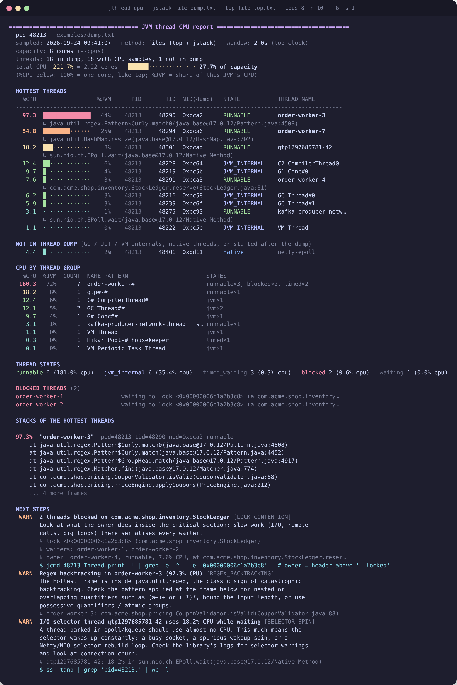
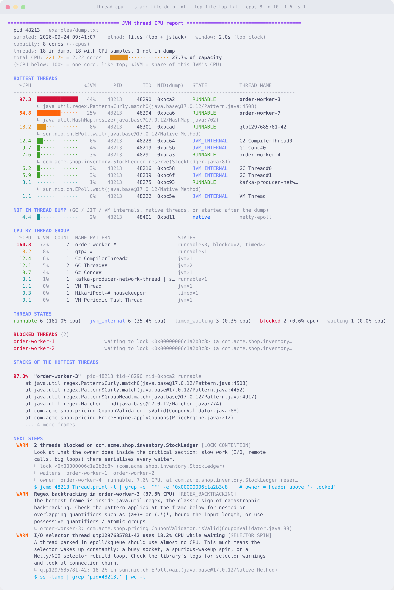

<div align="center">

# 🔥 jthread-cpu

**Which Java thread is eating my CPU?** Get the answer in one command.

[](https://github.com/bytebeast/jthread-cpu/releases)
[](#compatibility-matrix)
[](requirements.txt)
[](#compatibility-matrix)
[](#compatibility-matrix)
[](schema/jthread-cpu-v1.schema.json)
[](https://catppuccin.com)
[](LICENSE)
[](https://github.com/bytebeast/jthread-cpu/stargazers)



</div>

---

## So what is this? 👋

It's 3am, your pager is going off, and `top` says `java` is sitting at 400% CPU. Cool. *Which* of its 200 threads though?

The usual routine goes like this: run `top -H`, copy a thread ID, convert it to hex in your head (or in a panic), `grep` a thread dump for `nid=0x…`, and repeat for the next thread. **jthread-cpu does all of that for you.** It samples per-thread CPU, grabs a thread dump, matches them up, and prints something you can actually read:

- 🌡️ **The hottest threads**, with a CPU bar, their share of the JVM, their state, and the frame they're running right now
- 📏 **CPU you can compare**: the total in cores and as a share of what the JVM can really use, container CPU quotas included
- 🧵 **CPU by thread group**, so `order-worker-1…50` shows up as one line instead of fifty
- 🚦 **A thread-state count**, plus a list of **BLOCKED** threads and the lock they're waiting on
- 💀 **Deadlocks**, shown right at the top in big red letters, because nothing else matters if the JVM is stuck
- 👻 **Native threads the dump didn't name** (GC, JIT, VM internals) so their CPU doesn't just go missing
- 🥞 **Full stacks** for the worst offenders
- 🧭 **Next steps**: a short, rule-based list of what to check next, with the exact commands
- 🔁 **Repeated sampling**, with a summary of which threads stayed hot and which just spiked
- 🤖 **Versioned JSON output** for scripts, dashboards and bots

It's **one Python file that only uses the standard library.** Copy it onto a box and run it. Nothing to `pip install`, no virtualenv needed.

---

## Table of contents

- [Requirements](#requirements)
- [Compatibility matrix](#compatibility-matrix)
- [Installation](#installation)
  - [Any Linux (the 10-second way)](#any-linux-the-10-second-way)
  - [Debian / Ubuntu](#debian--ubuntu)
  - [RHEL / Fedora / CentOS / Rocky / Alma / Amazon Linux](#rhel--fedora--centos--rocky--alma--amazon-linux)
  - [Arch, Alpine and friends](#arch-alpine-and-friends)
  - [Nix / NixOS](#nix--nixos)
  - [macOS](#macos)
  - [Installing it as a command with pip / pipx](#installing-it-as-a-command-with-pip--pipx)
- [Usage and examples](#usage-and-examples)
- [Reading the CPU numbers](#reading-the-cpu-numbers)
- [Next steps (investigation hints)](#next-steps-investigation-hints)
- [JSON output and schema](#json-output-and-schema)
- [How it works](#how-it-works)
- [All the flags](#all-the-flags)
- [Troubleshooting](#troubleshooting)
- [Contributing](#contributing)

---

## Requirements

Here's the short list:

| What | Why | Needed for |
|---|---|---|
| **Python 3.7+** | runs the script | always |
| **A JDK** (with `jcmd` or `jstack`) | takes the thread dump | live mode (not needed for offline file analysis) |
| **`top`** from procps / procps-ng | per-thread CPU sampling | Linux with `--method top` (the default on Linux) |

A few things worth knowing up front:

- **You need a JDK, not a JRE.** A plain JRE doesn't ship `jcmd`/`jstack`. The `-headless` JDK packages work great on servers.
- **The JDK tools don't have to match the app's JVM exactly.** In testing, `jcmd` from JDK 21 attached fine to JDK 8, 11, 17 and 25 apps. If it ever gets grumpy, point at the app's own JDK with `--jstack-bin`.
- **On macOS,** sampling uses two thread dumps and the `cpu=` field, which only shows up in dumps from **JDK 11 and newer**.
- **No `top`? No problem.** `--method proc` reads `/proc` directly and doesn't need anything else installed. On Linux, `auto` switches to it by itself when there's no `top`.

Copy-paste versions for each package manager:

| Package manager | Command |
|---|---|
| 🍺 **brew** (macOS) | `brew install python openjdk` |
| 🐧 **apt** (Debian/Ubuntu) | `sudo apt install python3 openjdk-17-jdk-headless procps` |
| 🎩 **dnf** (Fedora/RHEL 8+) | `sudo dnf install python3 java-17-openjdk-devel procps-ng` |
| 🎩 **yum** (CentOS 7/Amazon Linux 2) | `sudo yum install python3 java-17-openjdk-devel procps-ng` |
| ❄️ **nix** | `nix-shell -p python3 jdk17_headless procps` |

> 💡 Swap `17` for whatever version your app runs on (`11`, `21`, `25`, …).

---

## Compatibility matrix

**Legend:** ✅ tested for this release · 🟡 supported, but not part of this release's test run · ⚠️ works, with a limitation · ❌ not supported

### Target JVM × sampling method

What the app you're inspecting runs on. All ✅ rows were run live against a test program with hot, blocked and idle threads on Linux x86_64, using the Ubuntu OpenJDK builds.

| Target JVM | `--method top` | `--method proc` | `--method jstack` | Offline: dump + `top` file | Offline: dump only |
|---|:-:|:-:|:-:|:-:|:-:|
| OpenJDK / HotSpot **8** | ✅ | ✅ | ❌ no `cpu=` in the dump | ✅ | ❌ no `cpu=`, refuses to print all-zero CPU |
| OpenJDK / HotSpot **11** | ✅ | ✅ | ✅ | ✅ | ⚠️ lifetime averages |
| OpenJDK / HotSpot **17** | ✅ | ✅ | ✅ | ✅ | ⚠️ lifetime averages |
| OpenJDK / HotSpot **21** | ✅ | ✅ | ✅ | ✅ | ⚠️ lifetime averages |
| OpenJDK / HotSpot **25** | ✅ | ✅ | ✅ | ✅ | ⚠️ lifetime averages |
| Other HotSpot builds (Temurin, Corretto, Zulu, Oracle, Microsoft, …) | 🟡 | 🟡 | 🟡 | 🟡 | 🟡 |
| Eclipse OpenJ9 / IBM Semeru | ❌ different thread-dump format | ❌ | ❌ | ❌ | ❌ |
| GraalVM native-image | ❌ no attach / `jcmd` | ❌ | ❌ | ❌ | ❌ |

The thread-dump format differs across these versions (hex `nid=0x…` up to 17, decimal `nid=…` plus `[tid]` from 21) and all of it is covered by real dumps in [`tests/fixtures/`](tests/fixtures/).

### Operating system and environment

| Where the tool runs | Status | Notes |
|---|:-:|---|
| **Linux** x86_64, glibc | ✅ | all methods; the default is `top` |
| Linux arm64 | 🟡 | nothing architecture-specific in the code |
| **Linux container, cgroup v1 CPU quota** | ✅ | quota detected and used as the capacity (tested with a real 0.5-core quota) |
| Linux container, cgroup v2 CPU quota (`cpu.max`) | ✅ | detection covered by tests, including nested limits where the tightest one wins |
| Kubernetes pod / `docker exec` | 🟡 | same code paths as above; see [example 19](#19-inside-docker--kubernetes-) |
| Alpine / BusyBox | ⚠️ | BusyBox `top` has no `-H`: use `--method proc` (or let `auto` pick it when there's no procps `top`) |
| WSL 2 | 🟡 | it's a real Linux kernel, so it behaves like Linux |
| **macOS** (Intel and Apple Silicon) | 🟡 | `--method jstack` only, target JDK 11+; `nid` there is a Mach port, not a TID |
| Windows (native) | ❌ | no `top -H` or `/proc`; use WSL 2, or capture a dump there and analyze it offline elsewhere |
| Offline analysis of captured files | ✅ | any OS with Python; no JDK needed |

### Python

| Python | Status |
|---|:-:|
| 3.6 and older | ❌ (uses `subprocess.run(text=True)`) |
| 3.7 | 🟡 compatible by static analysis (`vermin`); no 3.7 interpreter in this release's test run |
| 3.8, 3.9, 3.10, 3.11, 3.12, 3.13 | ✅ full test suite |
| 3.14 (release candidate) | ✅ full test suite |

### `top` implementations

| `top` | Status |
|---|:-:|
| procps-ng 3.3 / 4.x (most Linux distros) | ✅ |
| BusyBox `top` (Alpine, many slim images) | ❌ use `--method proc` |
| macOS `top` | ❌ no per-thread mode; `auto` uses `--method jstack` |

---

## Installation

This part is pretty relaxed. At its core, "installing" jthread-cpu just means **downloading one file and making it executable.** Pick your flavor below 👇

### Any Linux (the 10-second way)

```bash
curl -fsSLo jthread-cpu https://raw.githubusercontent.com/bytebeast/jthread-cpu/main/jthread-cpu
chmod +x jthread-cpu
sudo mv jthread-cpu /usr/local/bin/     # optional, but nice

jthread-cpu --version
```

That's it. Seriously. If `curl` isn't around, `wget -O jthread-cpu <same url>` works too.

> 🔒 Stuck on an air-gapped box? Just `scp` the file over. It doesn't need the internet or anything from PyPI.

### Debian / Ubuntu

First the prerequisites. Most servers already have `python3` and `procps`, so usually it's only the JDK you're missing:

```bash
sudo apt update
sudo apt install -y python3 openjdk-17-jdk-headless procps curl
```

Then grab the script:

```bash
sudo curl -fsSLo /usr/local/bin/jthread-cpu \
  https://raw.githubusercontent.com/bytebeast/jthread-cpu/main/jthread-cpu
sudo chmod +x /usr/local/bin/jthread-cpu
```

Give it a spin:

```bash
jthread-cpu --list      # shows the JVMs it can see
jthread-cpu             # if there's only one, it just goes for it 🚀
```

> 🐳 **Slim Docker images** (`debian:*-slim`, `eclipse-temurin:*-jre`) often don't include `procps`, so there's no `top` either. jthread-cpu then uses `--method proc` automatically, or you can `apt install procps`.

### RHEL / Fedora / CentOS / Rocky / Alma / Amazon Linux

On Fedora and RHEL 8+ (plus Rocky, Alma and Amazon Linux 2023), use `dnf`:

```bash
sudo dnf install -y python3 java-17-openjdk-devel procps-ng curl
```

Still on `yum` (CentOS 7, Amazon Linux 2)? Same idea:

```bash
sudo yum install -y python3 java-17-openjdk-devel procps-ng curl
```

> ⚠️ **Heads up for CentOS/RHEL 7:** the stock `python3` there is 3.6, and jthread-cpu needs **3.7+**. Install a newer Python (for example `rh-python38` from Software Collections, or `python38` on Amazon Linux 2 via `amazon-linux-extras`) and run the script with that interpreter.

> 📦 On Red Hat systems, `jcmd` and `jstack` come in the **`-devel`** package. The plain `java-17-openjdk` package is only the runtime.

Then grab the script:

```bash
sudo curl -fsSLo /usr/local/bin/jthread-cpu \
  https://raw.githubusercontent.com/bytebeast/jthread-cpu/main/jthread-cpu
sudo chmod +x /usr/local/bin/jthread-cpu
```

### Arch, Alpine and friends

```bash
# Arch / Manjaro
sudo pacman -S python jdk17-openjdk procps-ng

# Alpine
apk add python3 openjdk17-jdk
```

> 🏔️ **Alpine note:** Alpine's `top` comes from BusyBox and doesn't support `-H`. Use `--method proc` from the start. It reads `/proc` directly and gives the same results.

Then use the same `curl` + `chmod` two-liner from [Any Linux](#any-linux-the-10-second-way).

### Nix / NixOS

Nix folks, this one's for you ❄️ No need to install anything globally. Just open a throwaway shell with everything you need:

```bash
# classic nix-shell
nix-shell -p python3 jdk17_headless procps curl

# or with flakes enabled
nix shell nixpkgs#python3 nixpkgs#jdk17_headless nixpkgs#procps nixpkgs#curl
```

Inside that shell, download and run it:

```bash
curl -fsSLo jthread-cpu https://raw.githubusercontent.com/bytebeast/jthread-cpu/main/jthread-cpu
chmod +x jthread-cpu
./jthread-cpu --list
```

Or run it in one go without keeping the shell around:

```bash
nix shell nixpkgs#python3 nixpkgs#jdk17_headless nixpkgs#procps \
  --command python3 ./jthread-cpu -p 12345
```

Want it around permanently on **NixOS**? Add the prerequisites to your `configuration.nix`:

```nix
environment.systemPackages = with pkgs; [
  python3
  jdk17_headless
  procps
];
```

…then `sudo nixos-rebuild switch`, and drop the script into `~/.local/bin` or wherever you keep your tools.

> 🔧 **About the shebang on NixOS:** there's no `/usr/bin/python3` there, but the script uses `#!/usr/bin/env python3`, so it works fine as long as `python3` is on your `PATH`.

### macOS

Homebrew makes this easy 🍺

```bash
brew install python openjdk
```

Homebrew's `openjdk` is *keg-only*, which means it isn't linked onto your `PATH` automatically. Link it so the system `java` wrappers can find it:

```bash
sudo ln -sfn "$(brew --prefix)/opt/openjdk/libexec/openjdk.jdk" \
  /Library/Java/JavaVirtualMachines/openjdk.jdk
```

(Prefer Temurin? `brew install --cask temurin` works just as well.)

Now grab the script:

```bash
curl -fsSLo /usr/local/bin/jthread-cpu \
  https://raw.githubusercontent.com/bytebeast/jthread-cpu/main/jthread-cpu
chmod +x /usr/local/bin/jthread-cpu
# on Apple Silicon, /opt/homebrew/bin or ~/.local/bin are good homes too
```

> 🍎 **Good to know on macOS:** there's no `top -H`, and `nid` in a thread dump is a Mach port rather than a real thread ID. jthread-cpu handles this automatically by switching to **`--method jstack`**: it takes two dumps a couple of seconds apart and compares each thread's `cpu=` counter. Your target JVM needs to be **JDK 11+** for that field to be there.

### Installing it as a command with pip / pipx

If you'd rather have it managed like a normal CLI tool, there's a `pyproject.toml` included:

```bash
# isolated install (recommended)
pipx install git+https://github.com/bytebeast/jthread-cpu.git

# or plain pip, from a clone
git clone https://github.com/bytebeast/jthread-cpu.git
cd jthread-cpu
pip install .

jthread-cpu --version
```

The command it installs is called `jthread-cpu`, same as the file. There are zero dependencies, so it installs almost instantly. `requirements.txt` is there too if your tooling expects one, but it's intentionally empty.

> 🐍 Inside the wheel the file is stored as the module `jthread_cpu`, because Python can't import names with a hyphen. You never type that name; it's only there so the `jthread-cpu` command has something to import.

---

## Usage and examples

Here's every way you can use it, from "just tell me what's wrong" to "feed this to my bot."

> 📝 Everything below writes `jthread-cpu`. If you're running it straight from a checkout, that's `./jthread-cpu`. Same file, same name.

### 1. Just run it 🪄

```bash
jthread-cpu
```

If exactly one JVM is running, it finds it (via `jps`, or `pgrep` as a fallback), samples for 2 seconds, and prints the report. If there are several, it lists them and asks you to choose with `--pid`.

### 2. See which JVMs are running

```bash
jthread-cpu --list
```

```
  48213  com.acme.shop.Main
  51007  org.apache.catalina.startup.Bootstrap
```

### 3. Point it at a specific JVM

```bash
jthread-cpu -p 48213
```

### 4. Show more (or fewer) threads

```bash
jthread-cpu -p 48213 -n 10     # the 10 hottest threads
jthread-cpu -p 48213 -n 0      # every single thread
```

### 5. Sample for longer

A 2 second window is fine for a CPU spin that's happening right now. For spiky or bursty load, give it more time, or sample repeatedly ([example 9](#9-sample-repeatedly-and-see-what-persists-)):

```bash
jthread-cpu -p 48213 -d 10     # 10 second sampling window
```

### 6. Get deeper stack traces

```bash
jthread-cpu -p 48213 -f 20           # 20 frames per stack
jthread-cpu -p 48213 -f 12 -s 10     # 12 frames each, for the top 10 threads
jthread-cpu -p 48213 -f 0            # skip the stacks section entirely
```

`-f` sets how *deep* each stack goes, and `-s` sets *how many* threads get a full stack.

### 7. Hide idle threads

```bash
jthread-cpu -p 48213 -m 1      # only show threads using ≥ 1% CPU
```

### 8. Pick a sampling method

`auto` (the default) picks `top` on Linux (or `proc` when there's no `top`) and `jstack` everywhere else. You can override it:

```bash
jthread-cpu -p 48213 --method top      # top -H -b (Linux)
jthread-cpu -p 48213 --method proc     # read /proc/PID/task/*/stat (Linux, no top needed)
jthread-cpu -p 48213 --method jstack   # two dumps, diff the cpu= field (portable, JDK 11+)
```

| Method | Platform | Needs | Good for |
|---|---|---|---|
| `top` | Linux | procps `top` | the default, and it matches what you see in `top -H` |
| `proc` | Linux | nothing | slim containers, BusyBox/Alpine, locked-down hosts; also counts CPU from threads that exited mid-sample |
| `jstack` | anywhere | JDK 11+ target | macOS, or when `top`/`/proc` aren't available |

`top`'s first iteration is always "since the process started," so it's thrown away and only the **last** one is used. `--samples 3` makes `top` run one more iteration per round, if you ever need that.

### 9. Sample repeatedly and see what persists 🔁

One snapshot can mislead: a thread might just have been busy at that moment. Take several rounds instead, and jthread-cpu ends with a **persistent hotspots** summary:

```bash
jthread-cpu -p 48213 -c 6 -i 10            # 6 rounds, 10 s apart, full report each round, then the summary
jthread-cpu -p 48213 -c 6 -i 10 --summary-only   # one progress line per round, then only the summary
jthread-cpu -p 48213 --watch               # redraw every round until Ctrl-C, then the summary
jthread-cpu -p 48213 --watch -d 5 -n 8 -f 0 --no-groups   # a compact live view
```

The summary lists every thread that was **hot** (≥ 25% of a core by default, change it with `--hot`) in at least one round:

```
  THREADS THAT WERE HOT
     AVG     MAX    HOT  PER ROUND  PATTERN     THREAD
    96.8    98.0    6/6  ██████     persistent  order-worker-3
          ↳ java.util.regex.Pattern$Curly.match0(java.base@17.0.12/Pattern.java:4508)  (6/6 hot rounds)
    31.0    94.5    2/6  ·▂█·▁█     recurring   report-builder-1
```

- **persistent**: hot in at least 80% of rounds. If the top frame also never moved, you get a `PERSISTENT_LOOP` hint, because that's what a loop that never finishes looks like.
- **recurring**: hot in two or more rounds. **spike**: hot exactly once.
- `AVG` counts rounds where the thread didn't exist as 0, so a thread that lived for one round can't look like a permanent hog.

Pressing Ctrl-C during `--count 0` / `--watch` still prints the summary for the rounds you got.

#### Keep the raw captures

```bash
jthread-cpu -p 48213 -c 10 -i 30 --save-dir /tmp/jt-incident
```

Every round writes `round-NNN-dump.txt`, the raw CPU sample (`round-NNN-top.txt` for the `top` method, `round-NNN-cpu.json` otherwise) and `round-NNN-report.json`, plus `summary.json` at the end. The `top` + dump pairs can be fed straight back in later:

```bash
jthread-cpu --jstack-file /tmp/jt-incident/round-003-dump.txt \
            --top-file   /tmp/jt-incident/round-003-top.txt --cpus 8
```

### 10. JSON output for scripts and bots 🤖

```bash
jthread-cpu -p 48213 -o json > report.json        # one document
jthread-cpu -p 48213 -c 5 -o json > series.json   # one document with all 5 reports + the summary
jthread-cpu -p 48213 --watch -o jsonl >> cpu.log  # one line per round, a summary line on Ctrl-C
```

The format is described in [JSON output and schema](#json-output-and-schema). Some handy `jq` one-liners:

```bash
# top 5 threads: name, CPU and the frame they're in
jthread-cpu -p 48213 -o json | jq -r '.threads[:5][] | "\(.cpu_pct)%  \(.name)  \(.top_frame)"'

# how much of its CPU capacity is the JVM using?
jthread-cpu -p 48213 -o json | jq '.cpu.pct_of_capacity'

# who's BLOCKED, and on what?
jthread-cpu -p 48213 -o json | jq '.threads[] | select(.state=="BLOCKED") | {name, waiting_on}'

# the next-step hints, one per line
jthread-cpu -p 48213 -o json | jq -r '.hints[] | "\(.severity)\t\(.id)\t\(.title)"'

# fail a health check if there's a deadlock
jthread-cpu -p 48213 -o json | jq -e '.deadlocks | length == 0' >/dev/null || echo "🚨 deadlock!"

# which threads stayed hot over 10 rounds?
jthread-cpu -p 48213 -c 10 -o json | jq -r '.summary.threads[] | select(.classification=="persistent") | .name'
```

(`--json` still works as an old alias for `-o json`.)

### 11. Offline / post-mortem analysis 🕵️

Can't run tools on the box, or want to look at it later? Capture two files there and analyze them anywhere, even on your laptop, with no JDK installed:

```bash
# on the server (run both close together)
PID=48213
top -H -b -n 2 -d 5 -p $PID -w 512 > top.txt
jcmd $PID Thread.print -l > dump.txt     # or: jstack -l $PID > dump.txt
nproc                                    # note the CPU count, or the container's quota

# anywhere else
jthread-cpu --jstack-file dump.txt --top-file top.txt --cpus 8
```

The sample window is read from `top`'s own clock (to the second). `--cpus` tells it how many cores the server had, so the report can show the total as a share of capacity; without it that part just says "unknown" instead of guessing from your laptop.

Only have the thread dump? That works too, as long as it came from JDK 11+. You'll get **lifetime-average** CPU from the dump's own `cpu=` / `elapsed=` fields (and a warning saying that's what you're seeing):

```bash
jthread-cpu --jstack-file dump.txt
```

> 🧪 Want to try it right now without a JVM? This repo ships a sample in [`examples/`](examples/). That's exactly what the screenshot above was made from:
> ```bash
> ./jthread-cpu --jstack-file examples/dump.txt --top-file examples/top.txt --cpus 8 -n 10
> ```

### 12. Themes 🎨

Colors come from [Catppuccin](https://catppuccin.com). The default is Mocha (dark):

```bash
jthread-cpu -p 48213 --theme mocha       # dark (default)
jthread-cpu -p 48213 --theme macchiato   # dark, a bit softer
jthread-cpu -p 48213 --theme frappe      # medium-dark
jthread-cpu -p 48213 --theme latte       # light, for light-background terminals ☀️
jthread-cpu -p 48213 --theme auto        # guesses from $COLORFGBG
```

<details>
<summary>☀️ Here's what Latte looks like on a light terminal</summary>
<br>

</details>

It uses 24-bit truecolor when your terminal supports it (`COLORTERM=truecolor`) and falls back to the closest xterm-256 colors when it doesn't.

### 13. Turn colors or Unicode off

```bash
jthread-cpu -p 48213 --no-color          # plain text
NO_COLOR=1 jthread-cpu -p 48213          # respects the NO_COLOR convention too
jthread-cpu -p 48213 --ascii             # # and . bars, -> arrows, no box-drawing glyphs
```

Colors turn off automatically when output is piped or redirected, so `jthread-cpu > report.txt` gives you a clean file. ASCII mode turns on automatically if your terminal can't encode the glyphs (like with `LANG=C`).

### 14. Trim the report

```bash
jthread-cpu -p 48213 --no-frames         # hide the one-line "↳ current frame" under each thread
jthread-cpu -p 48213 --no-groups         # hide the "CPU by thread group" roll-up
jthread-cpu -p 48213 --no-hints          # hide the "NEXT STEPS" section
jthread-cpu -p 48213 -n 5 -f 0 --no-groups --no-frames --no-hints   # the tiny version
```

### 15. Spotting deadlocks 💀

You don't need to do anything special. If the thread dump says `Found one Java-level deadlock`, the report opens with a red **DEADLOCK DETECTED** banner showing who's waiting on whom, before anything else, and `DEADLOCK` is the first of the next steps. In JSON it shows up under `deadlocks`, `deadlock_stacks` and `hints`.

### 16. A JVM that won't respond

If a normal attach times out because the JVM is completely hung, you can let it fall back to `jstack -F`:

```bash
jthread-cpu -p 48213 --force
```

> ⚠️ `-F` uses the serviceability agent, which pauses the process while it runs and only exists in older JDKs (8-ish). Treat it as a last resort.

### 17. Using a specific JDK or top binary

```bash
jthread-cpu -p 48213 --jstack-bin /opt/jdk-21/bin/jcmd
jthread-cpu -p 48213 --jstack-bin /usr/lib/jvm/java-8-openjdk/bin/jstack
jthread-cpu -p 48213 --top-bin /usr/local/bin/top
```

Handy when the app runs on a different JDK than the one on your `PATH`. Either way the dump is taken with `-l`, so `java.util.concurrent` lock owners are included.

### 18. Running as the JVM's user

The attach API only lets the **same user** that owns the JVM connect to it. If you get "well-known file is not secure" or "Operation not permitted," run it as that user:

```bash
sudo -u "$(ps -o user= -p 48213)" jthread-cpu -p 48213
```

(jthread-cpu prints this exact hint for you when it spots that error.)

### 19. Inside Docker / Kubernetes 🐳

Copy it into the container and run it there. It's just one file:

```bash
# Docker
docker cp jthread-cpu myapp:/tmp/
docker exec -it myapp python3 /tmp/jthread-cpu --method proc

# Kubernetes
kubectl cp jthread-cpu mypod:/tmp/jthread-cpu
kubectl exec -it mypod -- python3 /tmp/jthread-cpu --method proc
```

Inside a container the JVM is often PID 1, so autodetect usually just works. The container's **CPU quota is picked up automatically** (cgroup v1 and v2), so "150% CPU" in a 2-core pod on a 64-core node is shown as 75% of capacity, not 2%. If the image has no Python, capture `top.txt` + `dump.txt` inside it and use offline mode ([example 11](#usage-and-examples)) from your machine instead, with `--cpus` set to the quota.

### 20. Version and help

```bash
jthread-cpu --version
jthread-cpu --help
jthread-cpu --print-schema     # the JSON Schema for -o json / -o jsonl
```

---

## Reading the CPU numbers

Every per-thread figure is measured **like `top`: 100% = one core fully busy.** A single thread can't go meaningfully above 100%, so the bar next to each thread is full at exactly one core.

The banner then puts the total in context:

```
  capacity: 2 cores (host 64, cgroup quota 2; limited by cgroup quota)
  total CPU: 150.0% = 1.50 cores   ███████████████····· 75.0% of capacity
```

- **cores**: the total divided by 100, which is easier to reason about than "150%".
- **capacity**: the CPU the JVM can actually get. It starts from the host's CPU count and is narrowed by the process's CPU affinity (`taskset`, cpusets) and by a cgroup CPU quota (containers). The banner says which one set it. For offline files, pass `--cpus N`.
- **% of capacity**: how close the JVM is to its ceiling. At 90% or more you get a `CAPACITY_SATURATED` hint, including where to read the throttling counters.
- **%JVM** (column): each thread's or group's share of the JVM's total CPU in this window. "This thread is 44% of the JVM" is often the fastest way to see whether you have one culprit or a crowd.

Prefer everything as a share of capacity instead? `--scale capacity` switches the `%CPU` column to `%CAP`, where 100% means all the cores the JVM can use.

A few more things the numbers now take care of:

- With `--method jstack`, the window is measured with the JVM's own per-thread `elapsed=` clock, so the time `jcmd` spends attaching isn't counted as idle time.
- With `--method proc`, threads born during the window are counted, and the process's own counters show how much CPU went to threads that already **exited** ("not in a live thread"). A lot of that means thread churn (`UNATTRIBUTED_CPU` hint).
- Per-thread hot thresholds used by the hints scale down under a fractional quota: in a 0.5-core container, a thread at 45% is as hot as it can get.

---

## Next steps (investigation hints)

At the end of every report, **NEXT STEPS** lists what to look at next. The hints are **deterministic**: each one comes from a fixed rule with a fixed threshold applied to the numbers in the report. No sampling, no heuristics that change between runs, no AI. The same input always gives the same hints in the same order (by severity, then by the rule order below).

| Rule id | Severity | Fires when | Suggests |
|---|---|---|---|
| `DEADLOCK` | critical | the dump reports a Java-level deadlock | the lock-ordering fix; saving the dump |
| `PERSISTENT_LOOP` | warning | *(repeated sampling, ≥ 3 rounds)* a thread was hot in ≥ 80% of rounds and its top frame never changed | the frame and the app frame that called it |
| `LOCK_CONTENTION` | warning | 2+ threads wait on the same monitor (or on a `j.u.c` lock with a visible owner) | who holds it, their CPU, and the frame they're in |
| `REGEX_BACKTRACKING` | warning | a thread ≥ 25% of a core has its top frame in `java.util.regex` | the application frame that applies the pattern |
| `MAP_LOOP` | warning | a thread ≥ 50% of a core is spinning inside `HashMap$TreeNode` / `TreeMap` / `WeakHashMap` | checking for an unsynchronized shared map |
| `HOT_THREAD` | warning | an application thread ≥ 80% of a core not explained by a rule above | repeated sampling of it; an async-profiler command |
| `SELECTOR_SPIN` | warning | a thread ≥ 10% of a core has its top frame in `epoll`/`kqueue`/`poll` wait | selector-spin / connection-churn checks |
| `GC_CPU` | warning | GC threads use ≥ 50% of a core, or ≥ 25% with ≥ 25% of the JVM's CPU | `jstat -gcutil`, `jcmd GC.heap_info` |
| `CAPACITY_SATURATED` | warning | the JVM uses ≥ 90% of its CPU capacity | the cgroup `cpu.stat` throttling counters |
| `UNATTRIBUTED_CPU` | warning | *(`--method proc`)* ≥ 20% of a core went to threads that exited mid-window | thread-creation counters |
| `POOL_SATURATED` | warning | every thread of a 3+ thread group is RUNNABLE/BLOCKED and the group uses ≥ 1 core | whether the work got slower or just more |
| `BURSTY_THREAD` | info | *(repeated sampling)* a thread hit ≥ 80% of a core in only some rounds | shorter rounds, a continuous profiler |
| `NATIVE_THREAD` | info | a thread missing from the dump uses ≥ 10% of a core | `/proc/…/comm`, `perf top -t` |
| `JIT_CPU` | info | JIT compiler threads use ≥ 50% of a core | `jcmd Compiler.queue` / `Compiler.codecache` |
| `JVM_IDLE` | info | the whole JVM used < 5% of a core | looking at waits instead; repeated sampling |
| `LIFETIME_AVERAGE` | info | offline with a dump but no `top` file | how to capture both |
| `SHORT_WINDOW` | info | the window was under 1 s | a longer `-d` |
| `LOW_COVERAGE` | info | fewer than half the dump's threads had a CPU sample | capturing the two files together |

Per-thread thresholds are in % of one core and scale down when the JVM's capacity is less than one core. Rule ids are part of the JSON contract, so it's safe to alert on them. `--no-hints` hides the section.

---

## JSON output and schema

`-o json` and `-o jsonl` output follows a **versioned JSON Schema** ([draft 2020-12](https://json-schema.org/draft/2020-12/schema)):

- the schema file: [`schema/jthread-cpu-v1.schema.json`](schema/jthread-cpu-v1.schema.json)
- the same schema from the tool itself: `jthread-cpu --print-schema`
- a full example document: [`examples/report.json`](examples/report.json)

Every document starts with:

```json
{
  "schema": "https://raw.githubusercontent.com/bytebeast/jthread-cpu/main/schema/jthread-cpu-v1.schema.json",
  "schema_version": "1.0.0",
  "kind": "report",
  "tool": { "name": "jthread-cpu", "version": "1.5.0" },
  ...
}
```

`kind` tells you what you're holding:

| `kind` | Produced by | Contains |
|---|---|---|
| `report` | `-o json` with one round; each line of `-o jsonl` | one sample: `capacity`, `cpu`, `coverage`, `threads`, `unmatched_native_threads`, `groups`, `states`, `contended_locks`, `hints`, `deadlocks` |
| `summary` | the last line of `-o jsonl` with 2+ rounds | per-thread `series`, `rounds_hot`, `avg/max/last_cpu_pct`, `classification`, `dominant_top_frame`, `hint_counts`, `hints` |
| `series` | `-o json` with `--count` > 1 | `reports` (every round) and `summary` |

A thread entry looks like this (trimmed):

```json
{
  "name": "order-worker-3",
  "pid": 48213,
  "cpu_pct": 97.3,
  "cpu_pct_of_capacity": 12.16,
  "share_of_jvm_pct": 43.89,
  "os_tid": 48290,
  "nid_hex": "0xbca2",
  "state": "RUNNABLE",
  "top_frame": "java.util.regex.Pattern$Curly.match0(java.base@17.0.12/Pattern.java:4508)",
  "app_frame": "com.acme.shop.pricing.CouponValidator.isValid(CouponValidator.java:88)",
  "stack": ["at java.util.regex.Pattern$Curly.match0(...)", "..."],
  "locks_held": [],
  "waiting_on": []
}
```

**Units:** every `*_pct` field without a suffix is **percent of one core** (`cpu.unit` says so explicitly). `*_of_capacity` is percent of the JVM's CPU capacity, and `share_of_jvm_pct` is percent of the JVM's total in that window. Unknown values are `null`, never `0`.

**Versioning policy** (SemVer on `schema_version`, independent of the tool's version):

- **MAJOR**: a field is removed or renamed, or its type or meaning changes. The schema file name carries the major version (`-v1`, `-v2`, …), so an old URL keeps describing old output.
- **MINOR**: fields or enum values (including hint ids) are added. **Consumers must ignore keys they don't know.**
- **PATCH**: descriptions and documentation only.

Everything the 1.4 JSON had is still there with the same meaning (`generated_at`, `pid`, `method`, `sample_window_s`, `cpu_count`, `total_thread_cpu_pct`, `threads[]`, `unmatched_native_threads[]`, `deadlocks`, …). Two small cleanups came with defining the schema: in offline mode `pid` is `null` when it isn't known (it used to be the string `"(from file)"`), and `cpu_count` is now always the host's CPU count (`null` offline) rather than the CPU count of whichever machine ran the analysis.

---

## How it works

On Linux, every Java thread is a real kernel thread. The JVM prints each one's native thread ID in the dump as `nid=0x…` (hex; JDK 21+ prints it in decimal), and `top -H` shows that same ID in decimal in its PID column. jthread-cpu:

1. **samples per-thread CPU** over your window (`top -H -b`, `/proc/PID/task/*/stat`, or two dumps' `cpu=` deltas),
2. **takes a thread dump** (`jcmd PID Thread.print -l`, falling back to `jstack -l`),
3. **matches them on the native ID**, handling hex, decimal, and the JDK 21+ `[tid]` format,
4. **works out the capacity** the JVM can use (host CPUs, affinity, cgroup quota),
5. **runs the hint rules** over the result,
6. and **renders** the report, putting anything it couldn't match under *"not in thread dump"* instead of quietly dropping it.

With `--count`/`--watch` it repeats steps 1–6 and keeps a per-thread history for the summary.

If it ends up with **no** CPU data at all, it refuses to print a report full of `0.0%` values, because "no data" is not the same thing as "idle" 🙂

---

## All the flags

| Flag | Default | What it does |
|---|---|---|
| `-p, --pid PID` | autodetect | JVM to inspect |
| `-d, --delay SEC` | `2` | sampling window |
| `--method` | `auto` | `auto` · `top` · `proc` · `jstack` |
| `--samples N` | `2` | top iterations per round (the last one is used) |
| `--jstack-file FILE` | | offline: read a thread dump from a file |
| `--top-file FILE` | | offline: read `top -H -b` output from a file |
| `--force` | off | allow `jstack -F` on a hung JVM |
| `--jstack-bin PATH` | from `PATH` | specific `jcmd`/`jstack` to use |
| `--top-bin PATH` | `top` | specific `top` to use |
| `-c, --count N` | `1` | number of rounds; `0` = until Ctrl-C |
| `-i, --interval SEC` | `0` | pause between rounds |
| `-w, --watch` | off | redraw every round (count defaults to `0`) |
| `--summary-only` | off | with several rounds, print only progress lines and the summary |
| `--hot PCT` | `25` | % of one core that counts as hot in the summary |
| `--save-dir DIR` | | keep each round's raw dump, CPU sample and JSON report |
| `--cpus N` | detected | CPU capacity in cores (needed to normalize offline files) |
| `--scale` | `core` | `core` (100% = one core) · `capacity` (100% = all usable cores) |
| `-n, --top N` | `15` | how many hot threads to show (`0` = all) |
| `-f, --frames N` | `8` | stack depth per hot thread (`0` = no stacks section) |
| `-s, --stacks N` | `5` | how many threads get a full stack |
| `-m, --min-cpu PCT` | `0` | hide threads below this %CPU |
| `-o, --output` | `text` | `text` · `json` · `jsonl` |
| `--print-schema` | | print the JSON Schema and exit |
| `--no-hints` | off | hide the NEXT STEPS section |
| `--theme` | `mocha` | `mocha` · `macchiato` · `frappe` · `latte` · `auto` |
| `--no-color` | off | disable ANSI color |
| `--ascii` | off | ASCII instead of box-drawing glyphs |
| `--no-frames` | off | hide the one-line current frame |
| `--no-groups` | off | hide the thread-group roll-up |
| `--list` | | list JVMs and exit |
| `-V, --version` | | print the version |

---

## Troubleshooting

<details>
<summary><b>"neither jcmd nor jstack found on PATH"</b></summary>

You've got a JRE, or no Java tools at all. Install a JDK (see [Requirements](#requirements)), or point at one with `--jstack-bin /path/to/jdk/bin/jcmd`.
</details>

<details>
<summary><b>"well-known file is not secure" / "Operation not permitted"</b></summary>

You're not the user running the JVM. Use `sudo -u <that-user> jthread-cpu -p PID`, as shown in [example 18](#18-running-as-the-jvms-user).
</details>

<details>
<summary><b>"Unable to open socket file"</b></summary>

Either it's not a JVM, the JVM is stuck in a long GC, or it was started with `-XX:+DisableAttachMechanism`. Wait a moment and try again, or try `--force`.
</details>

<details>
<summary><b>"could not understand top output (busybox top?)"</b></summary>

Your `top` doesn't support `-H`. Use `--method proc`.
</details>

<details>
<summary><b>"this JDK's thread dump has no cpu= field (JDK 8?)"</b></summary>

`--method jstack` needs a JDK 11+ target. On Linux, use `--method top` or `--method proc` instead.
</details>

<details>
<summary><b>"no per-thread CPU data at all"</b></summary>

jthread-cpu got a thread dump but no CPU numbers it could match to it, so it stopped rather than show you a report that's all zeros. In offline mode, pass a `--top-file` captured at about the same time as the dump.
</details>

<details>
<summary><b>"-o json writes one document at the end"</b></summary>

`--watch` (or `--count 0`) never ends on its own, so there's no "end" to write one JSON document at. Use `-o jsonl` for one line per round, or give a `--count`.
</details>

<details>
<summary><b>Total CPU is over 100%?</b></summary>

That's expected. It's measured like `top`, where 100% means one full core. The banner also shows it in cores and as a percentage of the JVM's capacity; see [Reading the CPU numbers](#reading-the-cpu-numbers).
</details>

<details>
<summary><b>Capacity looks wrong in a container</b></summary>

jthread-cpu reads the JVM's cgroup from `/proc/PID/cgroup` and walks up to find the tightest CPU quota. If you run it on the *host* against a containerized JVM and the cgroup path isn't visible from where you are, it falls back to its own cgroup. Pass `--cpus N` to set the capacity yourself.
</details>

---

## Contributing

PRs and issues are very welcome 💜 A few ground rules keep it easy to carry around:

- **Standard library only.** It needs to run on a random prod box with nothing installed.
- **One file.** `scp`-ability is a feature. The file is called `jthread-cpu`, no extension, so every doc and command spells the tool the same way.
- **Python 3.7 compatible.**
- **The JSON schema is a contract.** If you change the JSON, update `json_schema()` in the script, bump `SCHEMA_VERSION` by the rules in [JSON output and schema](#json-output-and-schema), and regenerate the file: `./jthread-cpu --print-schema > schema/jthread-cpu-v1.schema.json`.
- **Hints stay deterministic.** New rules get a new id in `HINT_RULES` (a MINOR schema bump) and a test.

Run the tests (no dependencies; install `jsonschema` too if you want the schema validation tests to run):

```bash
python3 -m unittest discover -s tests
./jthread-cpu --jstack-file examples/dump.txt --top-file examples/top.txt --cpus 8
```

The screenshots and the GitHub social preview (`docs/jthread-cpu-social-preview.png`, uploaded under *Settings → General → Social preview*) are rendered from real output by `docs/make-images.py` (needs Playwright). Regenerate them whenever the report layout changes.

---

<div align="center">

Made with ☕ and a lot of 3am pages. MIT licensed.

If it saved your night, a ⭐ would be lovely.

</div>
